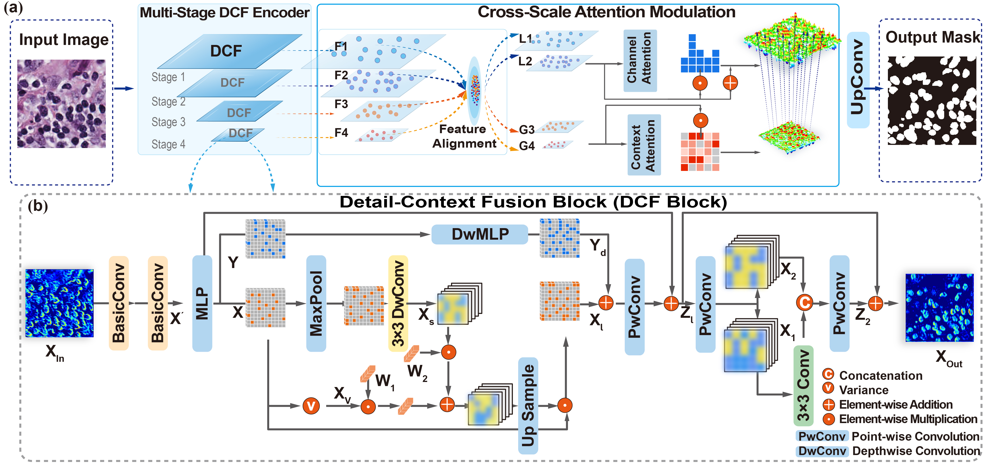
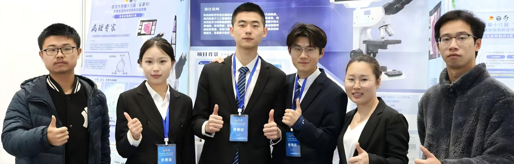

<table>
<tr>
<td align="left">
  <h1 style="margin: 0;">
    <!-- <em>IEEE TMI 2025</em><br> -->
    CSAMNet: Cross-Scale Attention Modulation for Histopathological Nuclei Segmentation
  </h1>
</td>
<td align="right">
  
</td>
</tr>
</table>

<p align="center">
  
  <br>
  <rm>Figure 1: CSAMNet Architecture</rm>
</p>

**📖Title：** CSAMNet: Cross-Scale Attention Modulation for Histopathological Nuclei Segmentation

**👨‍💻Author：** Jin Huang · Shengqian Wang · Mengping Long · Taobo Hu · Zhaoyi Ye · Yueyun Weng · Du Wang · Sheng Liu (*Fellow, IEEE*) · **Liye Mei** · **Cheng Lei**

**📬 Corresponding Authors**

- **Liye Mei** · [liyemei@whu.edu.cn](mailto:liyemei@whu.edu.cn)  
- **Cheng Lei** · [leicheng@whu.edu.cn](mailto:leicheng@whu.edu.cn)  


**Link：** [](https://github.com/huangjin520/CSAMNet) []() [](https://www.lei-whu.com)


**📜Abstract:** <p align="justify"> Accurate nuclei segmentation in histopathological images is a fundamental task in computational pathology, enabling downstream applications such as tumor grading, cellular phenotyping, and morphological analysis. However, it remains challenging due to the complex tissue architecture, diverse nuclear morphology, and blurred boundaries. To address these issues, we propose CSAMNet, a framework with four key innovations. First, we introduce the Cross-Scale Attention Modulation (CSAM) mechanism, which bridges the gap between hierarchical semantics and local details via dual-branch attention pathways. Second, we design the Detail-Context Fusion (DCF) block, which captures high-frequency contextual features. Third, we conduct comprehensive evaluations across four imaging modalities and nine datasets, demonstrating robust performance and effective semantic modulation across scales. Fourth, our framework supports full-resolution inference on whole slide images (WSIs), enabling deployment in large-scale clinical scenarios. In summary, our model achieves state-of-the-art accuracy while reducing model complexity and inference time, making it well-suited for both research and clinical applications. The code is available at [CSAMNet](https://github.com/huangjin520/CSAMNet).

# Introduction
This is an official implementation of [CSAMNet: Cross-Scale Attention Modulation for Histopathological Nuclei Segmentation](). ...


## 🚀 Quick start
### 1️⃣ Installation
Assuming that you have installed PyTorch and TorchVision, if not, please follow the [officiall instruction](https://pytorch.org/) to install them firstly. 
Intall the dependencies using cmd:

``` sh
python -m pip install -r requirements.txt --user -q
```

All experiments use the PyTorch 1.8 framework in a Python 3.10 environment. Other versions of pytorch and Python are not fully tested.
### 📂 Data preparation
We have evaluated segmentation performance on Four nuclei segmentation datasets: 
- [🔬CPM17](https://www.frontiersin.org/journals/bioengineering-and-biotechnology/articles/10.3389/fbioe.2019.00053/full)  
- [🔬Kumar](https://ieeexplore.ieee.org/abstract/document/7872382)  
- [🔬MoNuSeg](https://ieeexplore.ieee.org/abstract/document/8880654)  
- [🔬PUMA](https://academic.oup.com/gigascience/article/doi/10.1093/gigascience/giaf011/8024182) 

Four other modality datasets:
- [🎀Dataset B](https://ieeexplore.ieee.org/abstract/document/8003418)
- [🧠Brain Tumor MRI](https://figshare.com/articles/dataset/brain_tumor_dataset/1512427)  
- [📂LIDC-IDRI](https://wiki.cancerimagingarchive.net/display/Public/LIDC-IDRI)  
- [🎀BACH2018](https://iciar2018-challenge.grand-challenge.org/dataset/)  


Dataset tree:
📂 DATASET  
└── 📂 MoNuSeg  
&emsp; ├── 📂 train  
&emsp; │ &emsp; ├── img  
&emsp; │ &emsp; └──  mask  
&emsp; ├── 📂 val  
&emsp; │ &emsp; ├──  img  
&emsp; │ &emsp; └── mask  
&emsp; └── 📂 test  
&emsp; &emsp; ├──img  
&emsp; &emsp; └── mask


### Training
The CSAMNet model can be trained on training set using the following: 

```
python train_CSAMNet.py 
``` 

The parameters of the model have been carefully designed. 
CSAMNet - Hardware: an NVIDIA RTX 3090 GPU and an Intel Core i9-10900X CPU.

## 📊 Evaluation
The CSAMNet model can be evaluated on validation set using the following: 

```
python eval.py 
``` 

<p align="center">
  
  <br>
  <rm>Figure: (a) Workflow of the CSAMNet-based WSI analysis pipeline. (b) Tumor burden heatmaps on the public BACH2018 dataset; red contours indicate cancer regions. (c) Predicted nuclei masks on in-house WSIs without ground truth.</rm>
</p>

## 📬 Contact
For any questions or collaborations, please contact [Jin Huang](mailto:jinhuang@whu.edu.cn), [Shengqian Wang](mailto:sqwang@whu.edu.cn) or open an issue on GitHub.


<p align="center">
  
  <br>
</p>

<div style="text-align: center;">
    
    
    
</div>


****